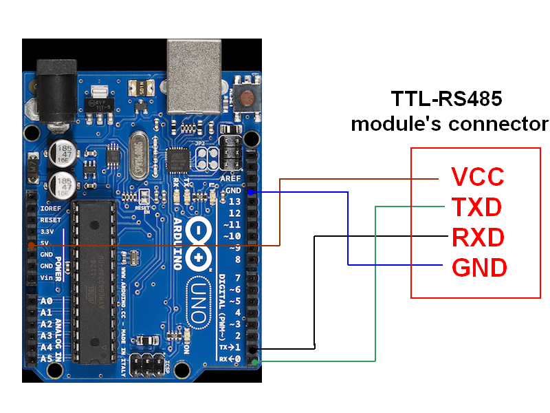
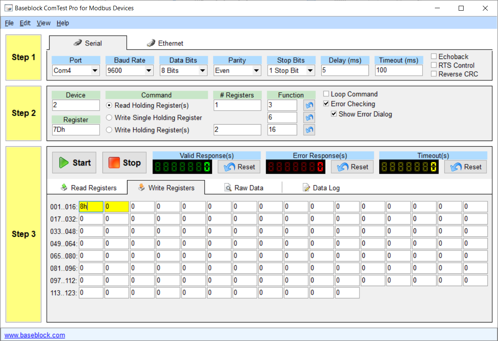

## Oriental Motor Communication Library
**Abstract**

This library provides the necessary functions to control BLV motors from Oriental Motor over RS485, using a Micro-Controller Unit (MCU).  
The library was developed for the following setup :

| Components | Selections | Links |
|---|---|---|
|Serial Interface| RS-485 | [Wikipedia RS-485](https://en.wikipedia.org/wiki/RS-485) |
| Communication Protocol | Modbus RTU | [Wikipedia Modbus RTU](https://en.wikipedia.org/wiki/Modbus) |
| Platform | Any Arduino-compatible board (Used the STM Nucleo L476-RG in this case) | [STM](https://www.st.com/en/evaluation-tools/nucleo-l476rg.html) |
| Motor | BLV640NM30F-1 | [Oriental Motor](https://www.orientalmotor.co.jp/products/detail.action?hinmei=BLV640NM30F-1&seriesCd=FJ00) |
| Library | STM32duino (Compatible with the standard Arduino Library) | [Github](https://github.com/stm32duino/Arduino_Core_STM32.git) |
| Adapter | DROK TTL to RS485 | [Drok](https://www.droking.com/ttl-to-rs485-module-dc-3.0v-30v-rs485-to-ttl-mutual-conversion-hardware-automatic-flow-control-module-converter-module) |

### Copyright

Copyright (C) 2019 Rakuten  

### Licence

BLV640_Library is free software: you can redistribute it and/or modify it under the terms of the GNU Lesser General Public  
Licensea s published by the Free Software Foundation, either version 3 of the License, or (at your option) any later version.
BLV640_Library is distributed in the hope that it will be useful, but WITHOUT ANY WARRANTY; without even the implied warranty  
of MERCHANTABILITY or FITNESS FOR A PARTICULAR PURPOSE. See the GNU Lesser General Public License for more details. You should  
have received a copy of the GNU Lesser General Public License along with BLV640_Library. If not, see <https://www.gnu.org/licenses/>.

### Materials

Oriental Motors provides User Manuals to explain how to operate the motors. But it takes a lot of time to completely understand how to operate the motors.  
So in this document, we will present the basic commands the user needs to know, and the page reference to learn more about it.

[Operating manual](https://www.orientalmotor.com/products/pdfs/opmanuals/HM-5112-6E.pdf)

[Basic function manual](https://www.orientalmotor.com/products/pdfs/opmanuals/HM-5113-8E.pdf)

[RS-485 communication manual](https://www.orientalmotor.com/products/pdfs/opmanuals/HM-5114-7E.pdf)

# **Micro Controller Configuration**

  

### Wiring the TTL to RS485 module

  


The wiring is very simple, all you have to do is connect the power and  
the serial lines to your micro-controller. First, take a look at the pinout  
for your device, I will use the very classic Arduino UNO R3 as an example.  
We can see that we have to connect :

-   GND to GND
-   VCC to 5V
-   TXD to 0
-   RXD to 1




***Since this board has only one Serial peripheral, we need to deactivate the log statement, see the related example in the lib.***

# **Analog Control Of The Motor**

  

### Setup the Driver

1.  Connect the motor and the power supply (cf Operating Manual p.7)
2.  Connect the Ethernet cable (used for the RS-485) to the Driver (cf User Manual - RS485 p.11)
3.  Set the switch SW2 (cf User Manual - RS485 p.9)
4.  Set the driver Id with the switches SW2 and SW3 (cf User Manual - RS485 p.9)
5.  Turn the potentiometer VR1 to change the speed and VR2 to change the acceleration (cf User Manual - Basic Function p.9)

  
At this point the motor will not turn yet. To make it turn, the user must send the "start rotation" signal.

***This setup does require the data setter OPX-2A.***

### Start Rotation

To make the motor spin, two methods can be used: through I/O signal connector (CN4) or through RS-485 with a computer.

**I/O signal connector (Not Tested)**

1.  Trigger a high state on the CN4 connector pin No.1 (cf Operating Manual p.8)

  

**Computer with RS-485 (Tested on Windos 10)**

1.  1.  Requirements :
        
        -   [DSD Tech SH - U10 USB to RS485 Converter](http://www.dsdtech-global.com/2018/01/sh-u10-spp.html),
            
        -   [ComTest Pro](http://www.baseblock.com/PRODUCTS/comtestpro.htm)
            
    2.  Wire the RS-485 Converter to your Ethernet cable
    3.  Connect the USB to your computer
    4.  Use ComTest Pro (cf the screenshot on the side)
        -   STEP 1 : Configure the serial parameters of ComTest Pro

_From the User Manual - RS485 p.12, the driver uses 8 bits of data, and a default configuration with Even parity and 1 stop bit.  
For the Baud Rate, it depends on the setup of the SW2 switch. Delays and Timeout does not really matter._

2.  1.  -   STEP 2 : Set your Modbus RTU message parameters

_Based on the Modbus RTU protocol, a message is composed as follow [slave_id, function code, register address, data, CRC16]_

-   _Device : Slave Id_
-   _Registers : Number of registers to read/write_
-   _Function : the first box is the function to read, the second one to write and the last one to write multiple registers (cf User Manual - RS485 p.13)_
-   _Register : Address of the first register to read/write_
-   _Command : Select the function code for the message_

3.  1.  -   STEP 3 : Write your data in the first yellow box

So, in our case we decided to use the slave Id No.2. And based on the User Manual - RS485 p.19, we must write the byte 0b00001000 (8 in hex) at the address 007Dh.  
Then, by clicking on the start button, we can send the message which will make the motor spin.



# **Digital Control Of The Motor**

  

### Setup the Driver

1.  Connect the motor and the power supply (cf Operating Manual p.7)
2.  Connect the Ethernet cable (used for the RS-485) to the Driver (cf User Manual - RS485 p.11)
3.  Set the switch SW2 (cf User Manual - RS485 p.9)
4.  Set the driver Id with the switches SW2 and SW3 (cf User Manual - RS485 p.9)
5.  Connect the Ethernet cable to the RS485 to TTL converter
6.  connect the RS485 to TTL converter to the Tx/Rx pins of the MCU

  

***This setup does require the data setter OPX-2A.***

  

### For Your Information

### Given that we are not using the data setter OPX-2A, we are restricted to the default configuration of the driver. Based on the User Manual - Basic Function p.41, the initial mode is the Mode 0. And on this mode, the operation data No.0 and No.1 are restricted to analog control.  
So, if we want to digitally control the motor over RS485 without changing the default configuration with the data setter, we must avoid using the operation data No.0 and No.1.  

The motor cannot operate in the range 0 - 80 rpm, and over 4000 rpm.

  

### Digital Control

To digitally control a BLV motor, it is critical to follow the following steps in order.

-   3-Wire mode

_The BLV640_Library uses the 3-wire mode (cf User Manual - RS485 p.20). Consequently, this mode must be set up before any operation.  
Write the byte 0x01 at the address 0x1041 _(cf User Manual - RS485 p.26).__

-   Recalculate the driver's parameters

_Certain commands, such as switching the Wire mode, are taken into account after the driver recalculate its parameters  
Write the byte 0x01 at the address 0x018D _(cf User Manual - RS485 p.22).__

-   Select the Operation Data No.2

_As mentioned in the previous subsection, the user must select an Operation Data Number greater than 1 to enable digital control. (cf User Manual - Basic Function p.39)  
Write the byte 0b00000010 at the address 0x007D (cf User Manual - RS485 p.19)._

The two first command are performed in the constructor such as the user does need to care about it. However, selecting the Operation Data Number needs to be done by the user. If not set properly, the motor will not spin.

  

Finally, the motor can be controlled by setting the speed and starting/stopping the rotation of the motor.

-   Set the Speed

_We are using the Operation Data No.2, so we must the rotation speed No.2 (cf User Manual - RS485 p.25).  
Writes the bytes "speed_val" (for example 200) at the address 0x0485 (cf User Manual - RS485 p.25)_

-   _Start Rotation_

_We are in 3-Wire mode, so we can rotate the motor with the bits 4 and 3 of the byte.  
Write the byte 0b00011010 at the address 0x007D ___(cf User Manual - RS485 p.19).____

-   Soft Stop

_We are in 3-Wire mode, so we can softly stop the rotation of the motor with the bit 3 of the byte._  
_Write the byte 0b00001010 at the address 0x007D (cf User Manual - RS485 p.19)._

-   Instant Stop

_We are in 3-Wire mode, so we can Instantly stop the rotation of the motor with the bit 3 of the byte._  
_Write the byte 0b00010010 at the address 0x007D (cf User Manual - RS485 p.19)._

-   Way of Rotation

_We are in 3-Wire mode, so we can change the sens of the rotation with the bit 5 of the byte._  
_Write the byte 0b00011010 at the address 0x007D for forward rotation (cf User Manual - RS485 p.19).  
_Write the byte 0b00111010 at the address 0x007D for reverse rotation (cf User Manual - RS485 p.19).__

***Instant stop may damage the motors at high speed***

# **BLV640_Library Description**

  

### Installation

You can clone the library from our github repository :

`git clone https://github.com/rakutentech/BLV640_lib.git`

  

### How to Use

You simply need to include the two following header files and use the blv_commands namespace :

```c++
#include <Arduino.h>
#include "blv_comm.h"
using namespace blv_commands;
```
  

Then, you must declare an array with the three following objects, with a small change for the arduino given that the Arduino Uno R3 does only have one Serial peripheral

**STM_Nucleo**
```c++
// Declare the serial port`
HardwareSerial* modbus::blv_serial;`

// The communication handle`
blv_comm* motors;`

// The IDs of the slaves (the motors)`
uint8_t slaves[4] = {0x01, 0x04, 0x07, 0x25};`
```

**Arduino_Uno**
```c++
// Declare the serial port
HardwareSerial* modbus::blv_serial;

// The communication handle
blv_comm* motors;

// The IDs of the slaves (the motors)
uint8_t slaves[4] = {0x01, 0x04, 0x07, 0x25};

// Since the Arduino UNO R3 has only one Serial peripheral,
// we cannot use the log function as it uses the only Serial,
// so we replace the print statement in the library by a placeholder
void emptyPrint(const char* msg) {
	(void)msg; //Doesn't do anything, and makes the compiler happy
}
```

In your setup function, you must initialize the serial communication. For the RS485, the baud-rate depends on the one set on your drivers. You must also specified the _Serial_8E1_ argument, which stands for 8 bits of data, Even parity and 1 stop bit.

**STM_Nucleo**
```c++
// Configure the serial port for the log info
Serial.begin(9600);

// First, configure the serial port the TTL to RS485 module is connected to
modbus::blv_serial = new HardwareSerial(PC11, PC10);
modbus::blv_serial->begin(9600, SERIAL_8E1);
```

**Arduino_Uno**
```c++
// First, configure the serial port the TTL to RS485 module is connected to, this time it's the default Serial
modbus::blv_serial = &Serial;
modbus::blv_serial->begin(9600, SERIAL_8E1);
```

Finally, create the blv_comm object with in argument the array of slave id previously created, with a small change for the arduino

**STM_Nucleo**
```c++
// Define the communication handle, specifying the slaves
motors = new blv_comm(sizeof(slaves), slaves);

// Set the log level to 0, which means log everything
motors->setLogLevel(0);
```
**Arduino_Uno**
```c++
// Define the communication handle, specifying the slaves and our replacement for the print statement
motors = new blv_comm(sizeof(slaves), slaves, emptyPrint);
```
  

### Functions Available

**config_Fwd_Direction(...)**

This function is used to define which sens of rotation corresponds to the forward direction

  

**electromagnetic_brake_action(...)**

This function defines the action of the electromagnetic brake when the motor stops moving, whether lock or unlock mode.

  

**select_mode(...)**

7 operation data number are available. The modes 0 and 1 are reserved for analog control. The modes 2 to 7 can be used to set different  
speeds and acceleration, such as the user can just switch from one mode to another to change to predefined speed and accelerations.

  

**set_torque_limit(...)**

Set the torque limit, after what the motor would stopped.

  

**set_speed(...)**

This function is used to set the speed for a specific operation data number. By default, this function would set the speed for the  
operation data No.2

  

**set_acc(...)**

Similar to the set_speed function but for acceleration and deceleration. When the acceleration type is not specified, it sets the  
acceleration and deceleration time

  

**set_Rotation_Direction(...)**

This function is used to switch the direction of rotation. Whether forward or reverse (backward).

  

**start_Rotation(...)**

This function makes the motor spin. However, if the speed of the current operation data number is lesser than 80 rpm, the motor  
will not turn.

  

**stop_rotation(...)**

This function is used to stop the motor. Two behavior can be chosen: soft brake or Instant brake. In the first case, the motor will  
decelerate whereas in the second case it will instantly stop.  
  
  

**diagnose(...)**

This function can be called to verify that the communication with a specific slave works.

  

**reset_alarm(...)**

Functions to reset the last alarm that occurred.

  

**clear_alert(...)**

This function clears the last alert (alarm, warning, communication error) that occurred.

  

**clear_all_alerts(...)**

This function clears all the alerts, the one that previously occurred as well as the one the last one.

  

**send_debug(...)**

This function is mainly used to send custom messages (for debug purposes)

  

**reading_registers(...)**

This function allows to read several registers at once.

  

**get_speed(...)**

This function returns the speed stored in the RAM of the Driver. It is possible to specify if we want to get whether the speed sent to the motor (command),  
or the actual speed of the motor (feedback from the sensors).

  

**exec_config(...)**

Certain instruction need the driver to perform a recalculation in order to become effective (cf User Manual - RS485)

  

**config_Fwd_Direction(...)**

This function is used to define which sens of rotation corresponds to the forward direction
